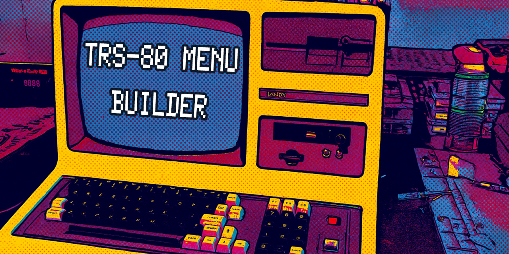
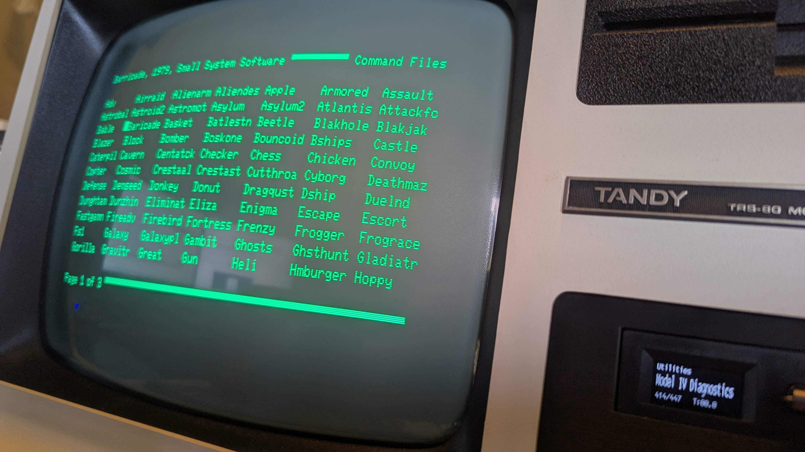

# TRS-80 Menu Builder

A Python script that generates a visual menu system in BASIC for TRS-80 Model III/4 computers running LDOS, MultiDOS, or LS-DOS. This tool addresses the limited availability of menu applications for TRS-80 systems by creating a fast, responsive navigation interface for your disk programs.

> **AI-Assisted Development Notice**
> 
> Hello, fellow human! My name is Aaron Smith. I've been in the IT field for nearly three decades and have extensive experience as both an engineer and architect. While I've had various projects in the past that have made their way into the public domain, I've always wanted to release more than I could. I write useful utilities all the time that aid me with my vintage computing and hobbyist electronic projects, but rarely publish them. I've had experience in both the public and private sectors and can unfortunately slip into treating each one of these as a fully polished cannonball ready for market. It leads to scope creep and never-ending updates to documentation.
> 
> With that in-mind, I've leveraged GitHub Copilot to create or enhance the code within this repository and, outside of this notice, all related documentation. While I'd love to tell you that I pore over it all and make revisions, that just isn't the case. To prevent my behavior from keeping these tools from seeing the light of day, I've decided to do as little of that as possible! My workflow involves simply stating the need to GitHub Copilot, providing reference material where helpful, running the resulting code, and, if there is an actionable output, validating that it's correct. If I find a change I'd like to make, I describe it to Copilot. I've been leveraging the Agent CLI and it takes care of the core debugging.
>
> With all that being said, please keep in-mind that what you read and execute was created by Claude Sonnet 4.5. There may be mistakes. If you find an error, please feel free to submit a pull request with a correction!

## Overview

The TRS-80 Menu Builder reads a directory listing from your TRS-80 disk image and generates a `MENU.BAS` file that displays all your programs in a multi-page, cursor-navigable menu. The resulting menu is optimized for minimal disk access and maximum responsiveness.



**Note:** This is a highly customized tool designed for a specific workflow. It's being shared publicly in case others find it useful for building their own menu systems for TRS-80 computers.

## Features

- **Dual OS Support**: Generates menus for both LDOS/MultiDOS (64x15, 7 columns) and LS-DOS (80x24, 8 columns)
- **Fast Navigation**: Arrow keys, page flipping with comma/period keys
- **Custom Labels**: Add descriptive text for programs that appears when selected
- **Automatic Sorting**: CMD files first, then BAS files, both alphabetically sorted
- **Minimal Memory Footprint**: Optimized for systems with limited BASIC workspace
- **Speed Commands**: Automatically uses SYSTEM (FAST/SLOW) on compatible systems

## Requirements

- Python 3.x (on your modern computer)
- TRS-80 Model III/4 running LDOS, MultiDOS, or LS-DOS
- A way to transfer files to/from TRS-80 disk images (e.g., TRS80GP, xtrs, or real hardware with disk utilities)

## Installation

1. Clone this repository or download `trs_80_menu_builder.py`
2. Export a directory listing from your TRS-80 disk image to a text file named `DIR.TXT`
3. Place `DIR.TXT` in the same directory as the Python script

## Usage

### Step 1: Create DIR.TXT

Export a directory listing from your TRS-80 disk image. The format should match standard TRS-80 directory output. The script looks for lines containing `/CMD` or `/BAS` file extensions.

**Example DIR.TXT:**
```
Drive :1 GAMES1   08/27/13 203H1 Free=  182.0/ 1624.0 Fi=123/240
Filespec      Attrib  LRL #Recs EOF DE File Size  MOD Date Time
----------------------------------------------------------------
DSHIP/CMD    ----- AL 256    45 127  1 s=   12.0
ESCAPE/CMD   ----- AL 256    68 127  1 s=   17.0
GAME/BAS     ----- AL 256    20 105  1 s=    6.0
```

Any line without `/CMD` or `/BAS` will be ignored. Other file extensions are not supported.

### Step 2: Add Custom Labels (Optional)

To add descriptive text that appears when a program is selected, append `**` followed by your custom text anywhere after the `/CMD` or `/BAS` extension:

```
DSHIP/CMD    ----- AL 256    45 127  1 s=   12.0 **Death Dreadnaught, 1980, Programmer's Guild
ESCAPE/CMD   ----- AL 256    68 127  1 s=   17.0 **Escape from Traam, 1980, Other-Ventures
```

All text following `**` becomes the label displayed in the menu header when that program is selected.

### Step 3: Configure OS Mode

Edit the Python script to set your target operating system:

```python
lsdos_mode = False  # False for LDOS/MultiDOS (default)
                    # True for LS-DOS
```

- **LDOS/MultiDOS**: 64x15 display, 7 columns, SPEED commands enabled
- **LS-DOS**: 80x24 display, 8 columns, no SPEED commands

### Step 4: Run the Script

```bash
python trs_80_menu_builder.py
```

The script generates `MENU.BAS` in the same directory.

### Step 5: Transfer and Run

1. Transfer `MENU.BAS` to your TRS-80 disk image
2. Boot your TRS-80 and load BASIC
3. Run the menu:
   ```
   RUN "MENU"
   ```

## Menu Navigation

Once the menu is running on your TRS-80:

- **Up/Down Arrow**: Move cursor vertically
- **Left/Right Arrow** (or Backspace/Tab): Move cursor horizontally
- **,** (comma): Previous page
- **.** (period): Next page
- **Enter**: Launch selected program

## Technical Details

### Design Requirements

This menu system was designed with several key requirements:

1. **Responsive and quick to navigate** - Minimal lag between keystrokes
2. **Minimal disk access** - All menu data loaded into memory at startup
3. **OS-agnostic output** - Single input file works for both LDOS and LS-DOS modes
4. **Memory efficient** - Leaves room for BASIC programs that need to run
5. **Enhanced information** - Shows custom labels not available in directory listings

### Menu Layout

- **Command files** are displayed first (all CMD files across pages)
- **BASIC files** follow (all BAS files across pages)
- Each category starts on a new page if the previous category doesn't fill its last page
- Programs within each category are sorted alphabetically

### Memory Allocation

The generated BASIC program uses `CLEAR 2000` to reserve memory. This should provide adequate space for most menu configurations while leaving room for BASIC programs to load.

### Version

Current version: **2.6.0**

## Limitations and Customization

This script is **highly specialized** for a specific use case and workflow. It was refined through multiple revisions for personal use on a TRS-80 Model 4D. You may need to modify the code to suit your specific requirements:

- The script assumes standard TRS-80 directory listing format
- Only `/CMD` and `/BAS` files are supported
- Display geometry is fixed for LDOS/MultiDOS or LS-DOS modes
- Custom labels must be manually added to `DIR.TXT`

## Programmer's Note

I tussled with the idea of generalizing this tool and wrapping it nicely with a bow, but I've decided to leave it as-is and put it out there. I'm happily using it daily to play games and launch applications on my TRS-80 Model 4D. I went through several revisions before posting what you see here. It was continually refined for stability and needed to meet the requirements listed above.

This is shared in the hope that it may help others who want to build a basic menuing system, since there are limited applications on the TRS-80s that can handle such a thing.

## Files

- `trs_80_menu_builder.py` - The menu generator script
- `dir.txt` - Your directory listing (input, not included in repository)
- `menu.bas` - Generated menu program (output, not included in repository)

## Contributing

This tool is provided as-is for the TRS-80 community. Feel free to fork and modify it for your own needs. Given its specialized nature, pull requests for major changes may not be accepted, but bug fixes and documentation improvements are welcome.

## License

Open source - use and modify as you wish.

## Acknowledgments

Created for daily use with a TRS-80 Model 4D running LDOS. Shared publicly to help others who want to build menu systems for these classic computers.